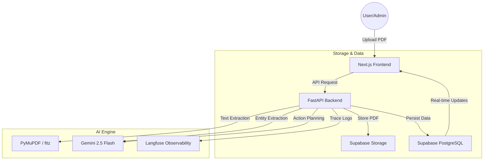
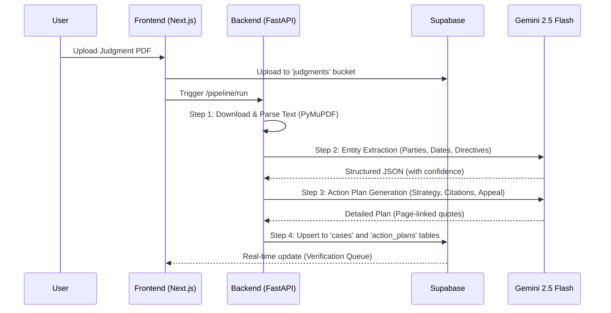

# Nyayodaya Architecture Blueprint

Nyayodaya is an AI-powered legal extraction and compliance management system designed to transform complex court judgments (PDFs) into actionable compliance plans. It supports both government writ petitions and private-party litigation.

---

## 1. High-Level System Architecture

Nyayodaya follows a modern decoupled architecture:



---

## 2. The AI Extraction Pipeline

The pipeline is a multi-stage process designed for high precision and verifiability.



### **Pipeline Steps Explained:**
1.  **Ingestion**: PDFs are securely stored in Supabase Storage.
2.  **Parsing**: `PyMuPDF` extracts raw text and structural metadata (page numbers).
3.  **Extraction (Gemini)**: Extracts Case Number, Court, Parties (Claimants/Respondents), and Key Directives.
4.  **Intelligence (Gemini)**: Generates a Compliance Strategy, Nature of Action, and Appeal Assessment.
5.  **Citations**: For every insight, the AI must provide a `quote` and a `page_number` from the source.
6.  **Persistence**: Data is saved in a relational schema, enabling fast dashboard filtering.

---

## 3. Technology Stack

| Layer | Technology | Purpose |
| :--- | :--- | :--- |
| **Frontend** | Next.js 15.1.0 | Core Web Application Framework |
| **Styling** | Tailwind CSS | Utility-first responsive design |
| **Backend** | Python / FastAPI | High-performance AI Orchestration |
| **AI Model** | Gemini 2.5 Flash | High-context window entity & logic extraction |
| **Database** | Supabase (PostgreSQL) | Relational storage & Real-time subscriptions |
| **Auth** | Supabase Auth | Secure officer authentication |
| **PDF Parsing**| PyMuPDF (fitz) | Reliable text and metadata extraction |
| **Observability**| Langfuse | Full-trace auditing of AI calls |

---

## 4. Generalized Data Model

Nyayodaya is built to handle multiple types of litigation:

*   **Government Cases**: Maps `respondent_department` to specific government bodies.
*   **Private Litigation**: Supports multiple `claimants` (Insurers, Owners) and `respondents` (Drivers, Private parties).
*   **Actionable Strategy**: Stores deep insights in the `action_plans` table, including:
    *   `nature_of_action`: (Administrative, Legal, Communication steps)
    *   `consideration_for_appeal`: Viability analysis for higher court review.
    *   `compliance_summary`: Executive summary for quick decision-making.

---

## 5. Evidence & Verifiability (The Citation Model)

To eliminate AI hallucinations, Nyayodaya uses an **Evidence-First** approach. Every AI-generated recommendation is anchored to the original document:

```json
{
  "compliance_summary": "The court directed the insurer to pay compensation within 30 days.",
  "source_citations": {
    "compliance_summary": {
      "quote": "The appellant/insurance company is directed to deposit the amount within four weeks.",
      "page": 14
    }
  }
}
```
In the UI, these citations are rendered as clickable page markers, allowing officers to verify the AI's logic against the physical PDF in seconds.

---

## 6. Performance Optimizations

*   **Summary Fetching**: The Dashboard uses a lightweight fetch (`?summary=true`) to load metrics instantly without joining heavy AI JSON blobs.
*   **Indexing**: Database indexes on `status`, `case_number`, and `order_date` ensure sub-second response times for thousands of records.
*   **Real-time Queue**: Uses Supabase Real-time to push processing updates to the UI without page refreshes.

---

> [!TIP]
> **Viewing Diagrams**: If you are viewing this file in VS Code, press `Ctrl + Shift + V` to open the preview and see the high-resolution Mermaid diagrams. On GitHub, these diagrams will render automatically.
